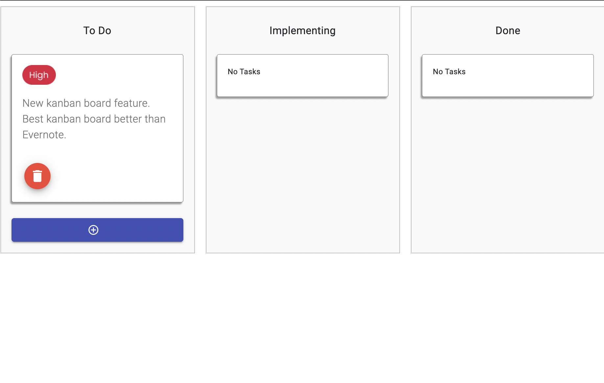

# KanbanBoard

This project was generated with [Angular CLI](https://github.com/angular/angular-cli) version 16.2.7.

## Demo

The live demo can be run at [github pages](https://otoaneba.github.io/kanban-board/). If the repository is set to private, this link will <b>not work</b>. The initial page should look like this. If the first time you visit the page does not look like the example below, please try and clear cacsche and reload the page or run the link in incognito mode.

## Prerequisite

Run `npm i` in order to install all the necessary packages if you are running this project locally.

## Development server

Run `ng serve` for a dev server. Navigate to `http://localhost:4200/`. The application will automatically reload if you change any of the source files.

## Code scaffolding

Run `ng generate component component-name` to generate a new component. You can also use `ng generate directive|pipe|service|class|guard|interface|enum|module`.

## Trouble shooting

If in any case the code does not run on the live demo link, please try clearing any cacshe and run again.
